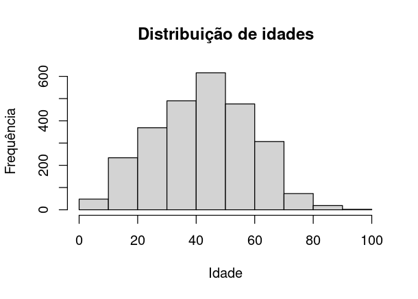

# ESPA5
## Febre amarela em humanos

### Nessa análise serão análisados os casos de Febre amarela em humanos, e tentaremos encontrar alguma relação entre incidência e óbitos com Sexo, estado e idade

**Head da tabela original**
|ID|MACRORREG_LPI|COD_UF_LPI|UF_LPI|COD_MUN_LPI|MUN_LPI|SEXO|IDADE|DT_IS|SE_IS|MES_IS|ANO_IS|MONITORAMENTO_IS|OBITO|
| --- | --- | --- | --- | --- | --- | --- | --- | --- | --- | --- | --- | --- | --- |
|1|2|N|14|RR|140045|Pacaraima|M|19|19/02/1995|8|2|1995|1994/1995|NÃO|
|2|3|NE|21|MA|210060|Amarante do Maranhão|M|32|01/04/1995|13|4|1995|1994/1995|IGN|
|3|4|NE|21|MA|210060|Amarante do Maranhão|M|33|03/04/1995|14|4|1995|1994/1995|SIM|
|4|5|N|15|PA|150270|Conceição do Araguaia|M|26|12/04/1995|15|4|1995|1994/1995|SIM|
|5|6|N|13|AM|130410|Tapauá|M|29|26/01/1996|4|1|1996|1995/1996|SIM|

A princípio não conseguimos retirar nenhuma informação. Porém após algumas manipulações no dataFrame, é possível observar o histograma através do seguinte trecho
```R
# Segue imagem do histograma
hist(fa_casoshumanos_1994_2021$IDADE, main = 'Distribuição de idades', xlab = 'Idade', ylab = 'Frequência')
```


Através do teste Shapiro, é possível identificar que se trata de uma distribuição normal
```R
shapiro.test(fa_casoshumanos_1994_2021$IDADE)
# Shapiro-Wilk normality test
# data:  fa_casoshumanos_1994_2021$IDADE
# W = 0.99385, p-value = 4.59e-09
```

Fazemos essa mesma visualização para os estados

```R
# Separando casos por estado
casos_x_estado <- count(fa_casoshumanos_1994_2021, fa_casoshumanos_1994_2021$UF_LPI, sort = TRUE)

# Adicionando frequência relativa
casos_x_estado <- casos_x_estado %>%
  mutate(frequencia_relativa = n/sum(n))

names(casos_x_estado) <- c('UF', 'NUM_OCORRENCIAS', 'FREQUENCIA_RELATIVA')

# Segue a imagem do gráfico
ggplot(casos_x_estado, aes(x = reorder(UF, -NUM_OCORRENCIAS), y = NUM_OCORRENCIAS, fill = FREQUENCIA_RELATIVA)) +
  geom_bar(stat = 'identity') +
  scale_fill_gradient(low = "lightblue", high = "darkblue") +
  labs(title = "Ocorrências por Estado",
       x = "Estado",
       y = "Número de Ocorrências") +
  theme_minimal()
```

Através desse gráfico é possível notar que o número de incidências é muito maior em minas Gerais e São Paulo do que em outros estados.

A mesma visualização para o Sexo
```R
casos_x_sexo <- count(fa_casoshumanos_1994_2021, fa_casoshumanos_1994_2021$SEXO)

casos_x_sexo <- casos_x_sexo %>%
  mutate(frequencia_relativa = n/sum(n))

names(casos_x_sexo) <- c('SEXO', 'NUM_OCORRENCIAS', 'FREQUENCIA_RELATIVA')


ggplot(casos_x_sexo, aes(x = reorder(SEXO, -NUM_OCORRENCIAS), y = NUM_OCORRENCIAS, fill = FREQUENCIA_RELATIVA)) +
  geom_bar(stat = 'identity') +
  scale_fill_gradient(low = "lightblue", high = "darkblue") +
  labs(title = "Ocorrências por Sexo",
       x = "Sexo",
       y = "Número de Ocorrências") +
  theme_minimal()
```

O número de incidências é muito maior em homens, conforme gráfico

```R
# Vendo se há uma diferênça significativa entre a idade dos homes e mulheres
t.test(IDADE ~ SEXO, data = fa_casoshumanos_1994_2021)

# O valor p de 0.1593 é maior que o nível de significância comum de 0.05. Portanto, não há evidência estatística suficiente para rejeitar a hipótese nula.
```

## Testes de hipótese
### Através dos testes, poderemos identificar se há alguma relação dos óbitos por febre amarela com os outros indicadores citados anteriormente

**Primeiro criamos uma classificação nova por faixa etária**
Utilizamos a regra de Sturges para definir quantas divisões teremos
```R
cat <- nclass.Sturges(fa_casoshumanos_1994_2021$IDADE)

fa_casoshumanos_1994_2021$faixa_etaria <- cut(fa_casoshumanos_1994_2021$IDADE, seq(0, 93, l = cat + 1), include.lowest = TRUE)
```
Obtemos as seguintes faixas e número de ocorrências
|fa_casoshumanos_1994_2021$faixa_etaria|   Nº Ocorrências   |
| --- | --- |
|[0,7.15]  |34|
|(7.15,14.3] | 64|
|(14.3,21.5] |221|
|(21.5,28.6] |265|
|(28.6,35.8] |279|
|(35.8,42.9] |404|
|(42.9,50.1] |490|
|(50.1,57.2] |345|
|(57.2,64.4] |303|
|(64.4,71.5] |149|
|(71.5,78.7] | 48|
|(78.7,85.8] | 20|
|(85.8,93] | 12|
  
Finalmente fazemos tabelas de contingência para as variáveis
```R
# Tabela de contingência para a variável OBITO em relação à SEXO
table(fa_casoshumanos_1994_2021$OBITO, fa_casoshumanos_1994_2021$SEXO)
```
| F  |  M |
| --- | --- |
  |IGN  |    20  | 62|
  |NÃO | 336 |1320|
  |SIM    | 113 | 883|

```R
assoc_measure <- assocstats(table(fa_casoshumanos_1994_2021$OBITO, fa_casoshumanos_1994_2021$SEXO))
assoc_measure$chisq  

#                  X^2       df P(> X^2)
# Likelihood Ratio 39.93726  2  2.126839e-09
# Pearson          38.12601  2  5.260681e-09

# ESTADO
table(fa_casoshumanos_1994_2021$OBITO, fa_casoshumanos_1994_2021$UF_LPI)
```
   |       AC|  AM|  BA|  DF|  ES|  GO|  MA|  MG|  MS|  MT|  PA|  PR|  RJ|  RO|  RR|  RS|  SC|  SP|  TO|
   | --- | --- | --- | --- | --- | --- | --- | --- | --- | --- | --- | --- | --- | --- | --- | --- | --- | --- | --- |
  |IGN      |0   |1   |0   |0  |31   |0   |1  |14   |0   |0   |9   |0  |11   |0   |0   |0   |2  |13   |0|
  |NÃO|   1|  17|   1|   2| 142|  46|   0| 704|   7|  10|  47|  12| 191|   0|   5|  12|  18| 428|  13|
  |SIM      |1  |29   |3   |8  |83  |52   |1 |372   |5  |17  |36   |2 |105   |2  |10   |9   |7 |244  |10|
```R

assoc_measure <- assocstats(table(fa_casoshumanos_1994_2021$OBITO, fa_casoshumanos_1994_2021$UF_LPI))
assoc_measure$chisq

#                  X^2      df P(> X^2)
# Likelihood Ratio 150.4436 36 6.661338e-16
# Pearson          188.5136 36 0.000000e+00

# Faixa_etaria
table(fa_casoshumanos_1994_2021$OBITO, fa_casoshumanos_1994_2021$faixa_etaria)

```
  |       [0,7.15]| (7.15,14.3]| (14.3,21.5] |(21.5,28.6]| (28.6,35.8]| (35.8,42.9]| (42.9,50.1] |(50.1,57.2] |(57.2,64.4] |(64.4,71.5] |(71.5,78.7] |(78.7,85.8] |(85.8,93]|
  | --- | --- | --- | --- | --- | --- | --- | --- | --- | --- | --- | --- | --- |
  |IGN           |3|           6|          10|           8|           4|          12|          11| 8|           5|           8|           0|           0|         0|
  |NÃO|       25|          46|         153|         184|         175|         253|         297| 193|         163|          77|          25|           7|         3|
  |SIM|           6|          12|          58|          73|         100|         139|         182| 144|         135|          64|          23|          13|         9|
        
         
       
```R

assoc_measure <- assocstats(table(fa_casoshumanos_1994_2021$OBITO, fa_casoshumanos_1994_2021$faixa_etaria))
assoc_measure$chisq

#                  X^2      df P(> X^2)
# Likelihood Ratio 86.40636 24 5.623197e-09
# Pearson          88.15194 24 2.909154e-09
```

## Conclusão
Os resultados indicam que o teste qui-quadrado é altamente significativo, tanto para o teste de razão de verossimilhança quanto para o teste de qui-quadrado de Pearson. Isso sugere que há uma associação significativa entre as variáveis OBITO e (Estado, Faixa etária e Sexo).

